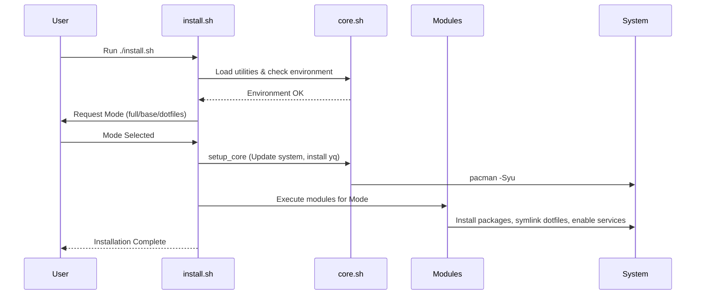

# Architecture Guide

This document provides a technical deep-dive into how the Arch Post-Installation Workbench is structured and how it operates.

## Design Philosophy

- **Modularity**: Every major system component (packages, dotfiles, users) is encapsulated in its own module.
- **Declarative Configuration**: The system state is defined in YAML files, separating "what" to install from "how" to install it.
- **Robustness**: Error handling, logging, and pre-flight checks are baked into the core engine.
- **User-Centric**: Designed to be run by a normal user with `sudo`, ensuring correct ownership and permissions.

## Directory Structure

| Directory | Purpose |
|-----------|---------|
| `config/` | YAML definitions for packages, services, and dotfiles. |
| `modules/` | Core logic modules (packages, dotfiles, system, etc.). |
| `profiles/` | Environment-specific orchestrators (e.g., Hyprland). |
| `dotfiles/` | The actual configuration files to be deployed to `~/.config/`. |
| `scripts/` | Standalone helper scripts for complex setups. |
| `logs/` | Timestamped logs for every installation run. |

## Module Breakdown

### `core.sh`
The "Engine" of the workbench.
- **YAML Parser**: Contains a fallback regex-based parser if `yq` is missing.
- **Logging**: Standardized `log_info`, `log_success`, `log_error` functions.
- **Checks**: Internet verification, root/sudo checks, and Arch Linux verification.

### `system.sh`
Handles system-wide common tasks.
- **Fonts**: Orchestrates system font installation.
- **Shell**: Manages default shell configuration.
- **Updates**: Wraps system update logic.

### `packages.sh`
...
### `dotfiles.sh`
...
### `services.sh`
...
### `users.sh`
...

## Profiles (`profiles/`)

Profiles are high-level orchestrators that combine modules to create a specific environment.

### `hyprland.sh`
The desktop environment orchestrator.
- Calls packages, services, and dotfiles modules specifically for the Hyprland environment.
- Handles GTK/theming defaults and XDG user directories.

## Installation Sequence

## Adding New Features

1. **New Package**: Add it to `config/base.yaml` (system-wide) or `config/hyprland.yaml` (desktop-specific).
2. **New Dotfile**: Place the folder in `dotfiles/` and add the name to the `dotfiles` list in `config/hyprland.yaml`.
3. **New Logic**: If you need new installation logic, create a new script in `modules/` and source it in `install.sh`.
