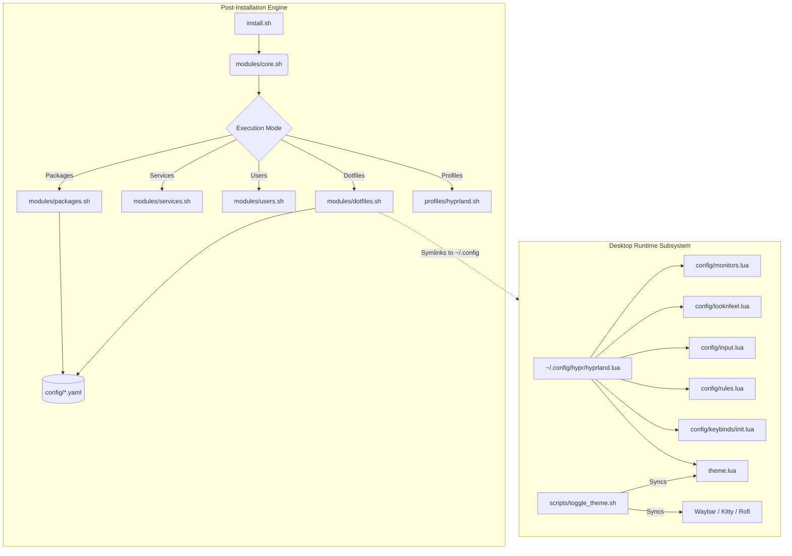
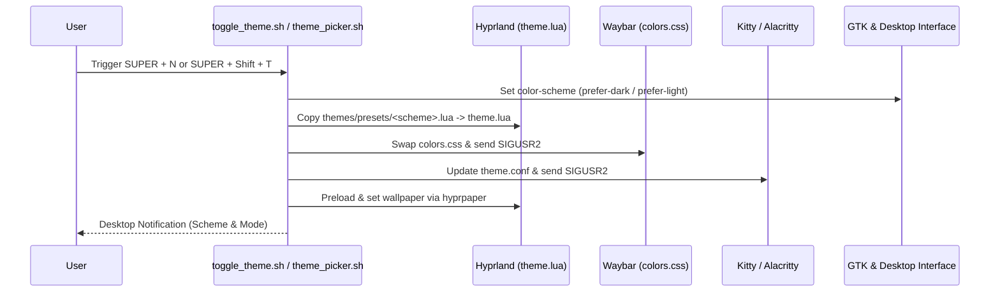

# System Architecture & Technical Design Guide

This document provides a comprehensive technical deep-dive into the architectural design, execution lifecycle, configuration engine, and desktop subsystem of the **Arch Linux Post-Installation Workbench**.

---

## 1. High-Level Architecture Overview

The system is split into two primary subsystems:
1. **The Post-Installation Workbench**: A declarative, idempotent shell engine that provisions packages, system daemons, user permissions, and symlinks dotfiles.
2. **The Modern Desktop Runtime**: A production-ready Wayland environment powered by **Hyprland (Lua Engine)**, Waybar, Rofi, and a centralized multi-scheme theming engine.


```mermaid
graph TD
    subgraph Workbench ["Post-Installation Engine"]
        A[install.sh] --> B(modules/core.sh)
        B --> C{Execution Mode}
        C -->|Packages| D[modules/packages.sh]
        C -->|Services| E[modules/services.sh]
        C -->|Users| F[modules/users.sh]
        C -->|Dotfiles| G[modules/dotfiles.sh]
        C -->|Profiles| H[profiles/hyprland.sh]
        
        D --> I[(config/*.yaml)]
        G --> I
    end

    subgraph Runtime ["Desktop Runtime Subsystem"]
        J[~/.config/hypr/hyprland.lua] --> K[config/monitors.lua]
        J --> L[config/looknfeel.lua]
        J --> M[config/input.lua]
        J --> N[config/rules.lua]
        J --> O[config/keybinds/init.lua]
        J --> P[theme.lua]
        
        Q[scripts/toggle_theme.sh] -->|Syncs| P
        Q -->|Syncs| R[Waybar / Kitty / Rofi]
    end

    G -.->|Symlinks to ~/.config| Runtime
```

---

## 2. Post-Installation Engine Design

### Design Principles
- **Declarative System State**: Configuration is declared in structured YAML files (`config/base.yaml`, `config/hyprland.yaml`), decoupling package lists and service definitions from shell logic.
- **Idempotency**: All module operations check current state (`pacman -Qi`, `systemctl is-enabled`, symlink validation) before executing changes, ensuring re-runs are safe and fast.
- **Fail-Safe Symlinking**: The dotfile deployment module automatically preserves timestamped backups of pre-existing user configurations before creating symlinks.
- **Structured Logging**: All operations output colorized console feedback while simultaneously logging detailed execution traces to `logs/install_<timestamp>.log`.

### Core Engine Modules (`modules/`)

| Module | Responsibility | Key Features |
|---|---|---|
| `core.sh` | Orchestration & engine utilities | YAML parser with fallback regex engine, logging handlers, network and root privilege validation. |
| `system.sh` | Core system provisioning | System clock synchronization, pacman mirror optimization, font installation, default shell configuration. |
| `packages.sh` | Package lifecycle manager | Batch pacman and AUR installation via `yay`, missing dependency resolution, package presence verification. |
| `services.sh` | Systemd service manager | Parses and enables systemd `.service` and `.timer` units for both system and user bus. |
| `users.sh` | User accounts & permissions | Default shell assignment (Fish), supplementary group membership (`wheel`, `video`, `input`, `audio`), locale & timezone. |
| `dotfiles.sh` | Configuration deployment | Symlinks `dotfiles/*` into `$HOME/.config/` with automatic `.bak` preservation. |

---

## 3. Desktop Runtime & Hyprland Lua Subsystem

Starting with Hyprland 0.55+, the compositor utilizes a native **Lua configuration engine** (`hyprland.lua`). The workbench structures this environment into an organized, modular hierarchy under `dotfiles/hypr/`:

```
dotfiles/hypr/
├── hyprland.lua                  # Primary entry point
├── theme.lua                     # Active color scheme & layer rules
│
├── config/                       # Core compositor modules
│   ├── monitors.lua              # Displays, scaling & output resolutions
│   ├── programs.lua              # Application aliases
│   ├── env.lua                   # Global environment variables (Wayland, GTK, QT)
│   ├── autostart.lua             # Daemon launch hooks (hl.on('hyprland.start'))
│   ├── looknfeel.lua             # Gaps, borders, animations, blur, shadows
│   ├── input.lua                 # Keyboard layouts, touchpad, gestures
│   ├── rules.lua                 # Consolidated window & layer rules
│   ├── permissions.lua           # Hyprland security permission rules
│   │
│   └── keybinds/                 # Modular keybinding subsystem
│       ├── init.lua              # Keybind loader
│       ├── core.lua              # Applications, window management, workspaces
│       ├── media.lua             # Volume, mic, brightness, media keys
│       ├── utilities.lua         # Power menu, screenshots, maintenance
│       └── personal.lua          # Personal tool hotkeys
│
├── themes/
│   └── presets/                  # 14 curated color palette presets (Lua)
│
├── scripts/                      # Desktop automation scripts
├── assets/                       # Backgrounds, logos, and icons
└── archive/                      # Preserved legacy .conf & backup files
```

### Lua Configuration Architecture & Lifecycle
1. **Module Resolution**: `hyprland.lua` augments Lua's `package.path` with `~/.config/hypr/` so submodules are loaded cleanly with standard `require("config.module_name")`.
2. **Event-Driven Autostart**: Rather than static `exec-once` directives, startup daemons are attached to the compositor lifecycle using `hl.on("hyprland.start", function() ... end)`.
3. **Dispatcher Mapping**: Keybindings map human-readable key chords to strongly typed dispatchers in the `hl.dsp.*` namespace (e.g. `hl.dsp.window.kill()`, `hl.dsp.window.float()`).

---

## 4. Unified Theming Engine

The theming system enables seamless dark/light switching and full palette transitions across 7 curated theme schemes:


```mermaid
sequenceDiagram
    participant User
    participant Switcher as toggle_theme.sh / theme_picker.sh
    participant Hyprland as Hyprland (theme.lua)
    participant Waybar as Waybar (colors.css)
    participant Terminals as Kitty / Alacritty
    participant GTK as GTK & Desktop Interface

    User->>Switcher: Trigger SUPER + N or SUPER + Shift + T
    Switcher->>GTK: Set color-scheme (prefer-dark / prefer-light)
    Switcher->>Hyprland: Copy themes/presets/<scheme>.lua -> theme.lua
    Switcher->>Waybar: Swap colors.css & send SIGUSR2
    Switcher->>Terminals: Update theme.conf & send SIGUSR2
    Switcher->>Hyprland: Preload & set wallpaper via hyprpaper
    Switcher-->>User: Desktop Notification (Scheme & Mode)
```

### Supported Theme Schemes
- **Catppuccin** (Mocha / Latte)
- **Tokyo Night** (Night / Day)
- **Gruvbox** (Dark / Light)
- **Everforest** (Dark / Light)
- **Nord** (Dark / Light Snow)
- **Rosé Pine** (Main / Dawn)
- **Default Dark / Light**

---

## 5. Adding New Features

### Adding a New Package
1. For core system tools: Add package name to `config/base.yaml` under `packages.pacman` or `packages.aur`.
2. For desktop tools: Add package name to `config/hyprland.yaml`.

### Adding a New Dotfile Directory
1. Place your configuration folder under `dotfiles/<app_name>/`.
2. Register `<app_name>` under the `dotfiles` list in `config/hyprland.yaml`.

### Adding a New Keybinding
1. Navigate to `dotfiles/hypr/config/keybinds/`.
2. Add your binding using `hl.bind("MOD + KEY", hl.dsp.exec_cmd("command"))` in the appropriate module (`core.lua`, `utilities.lua`, or `personal.lua`).
3. Reload Hyprland with `hyprctl reload`.
